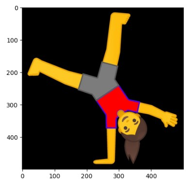

# image_manipulation

## Overview

In this exercise, you should look for an image that you will use to do some manipulations with. It is highly important that you do all your image manipulations using the raw image data in Numpy (and do not use the PIL object).

## Github

https://github.com/Marvalutions/image_manipulation.git

## Data

./data/input/radslag.jpg : image on which the manipultions will be performed

## Approach

Everything is coded in one jupyter notebook './notebooks/image_manipulation'.

All manipulated images are shown one under the other.

## Detailed assignment

**Step 1: Initialize Git Repository**

https://github.com/Marvalutions/image_manipulation.git

**Step 2: Create Virtual Environment with Anaconda**

./imageenv.yml

**Step 3: Choose & load image**

I chose the following image:

**Step 4: Do my image manipulations**

**Step 5: Your own manipulations**

